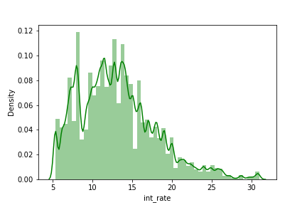
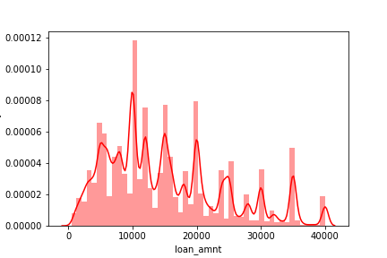
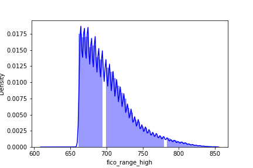
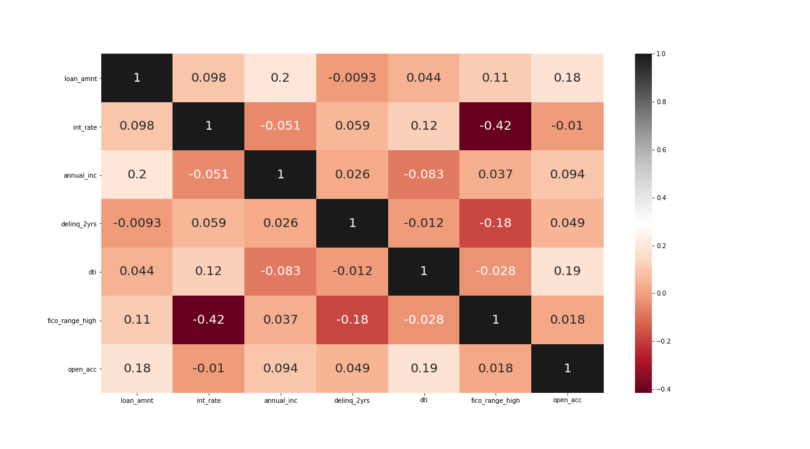

# Lending Tree Analysis
Lending Tree EDA

## Project Purpose and Description
The purpose of this project is to create a data warehouse through an automated ETL pipeline prototype to be used for structured query and analysis. 

## Tools (all using Python and its libraries)
   - Pandas
   - PySpark
   - Seaborn
   - Matplotlib
   - Parquet files

## Data
The Data used for this project is Lending Club Loan Data available from their website.  (Taken as a csv from [Kaggle](https://www.kaggle.com/wordsforthewise/lending-club))

2 csvs consisting of accepted loan data and rejected loan data.

### Accepted Loan Data 

2_260_701 data points and 151 features 

### Rejected Loan Data

27_648_741 data points and 9 features

## Summary Statistics and Visualizations 

      

 The average interest rate of accepted loans is 13.1%. 

 The average loan amount of accepted loans is 15,046. 

 The average fico credit score for individuals of accepted loans is 703. 

According to the plot, there is a slight correlation between annual income, number of open accounts, credit score, debt to interest ratio and being granted a loan. 
The correlation is slight and does not prove causation.  Further analyses would be done to determine if the assumptions of linearity are satified/or 
there is a case for regression.

## Conceptual Database Model 

I structured this database using two start schemas as both csvs do lot have any commonalities.  The fact tables are the Accepted Loan Details and the
Rejected Loan Details.  

### Accepted Loan Details Table (Fact)

loan_id,
member_id,
loan_amount,
grade,
sub_grade,
int_rate,
term,
issue_d,
loan_status,
purpose,
earliest_cr_line

### Accepted Time Table (Dimension)

start time,
hour,
day,
week,
month,
year 

### Accepted User Table (Dimension)

member_id,
issue_d,
credit_score,
home_ownership,
ann_income

### Rejected Loan Details Table (Fact)

Amount Requested,
Policy_code,
State,
Amount Requested,
Loan Title

### Rejected User Table (Dimension)

Risk_score,
Debt-To-Income Ratio,
State,
Zip_Code

### Rejected Time Table (Dimension)

Applicatation Date,
State

### Rejected Location Table (Dimension)

State,
Zip Code

## Conclusion & Final Thoughts

Considering this is a smaller dataset, using a pandas dataframe for storage and cleaning is sufficient.  As the data scales vertically, more computing power 
would be needed and the data should be stored across a cluster.  Using an operational database like PostgreQSL or taking it to the cloud implemeting AmazonRedshit
will be effective in handling the growing size.  The data used above is batch data and can be scheduled to update whenever needed  (Using a task manager like Airflow).
If real time data is needed for processing, a tool like Apache Kafka will be key in production.  Adding dimensions like location and employee to the accepted loan 
details table would make searching algorithmns more efficient (less operations to traverse through).
